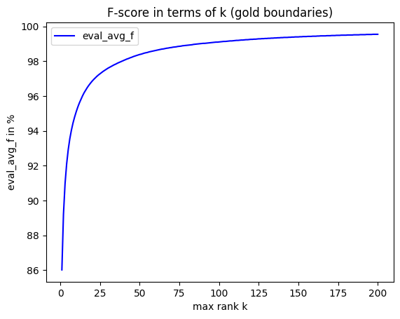
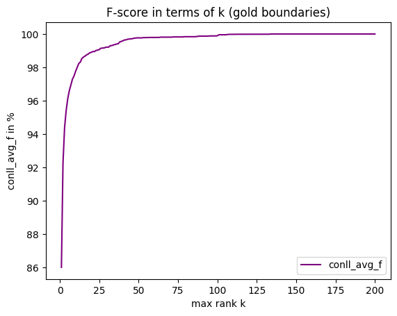
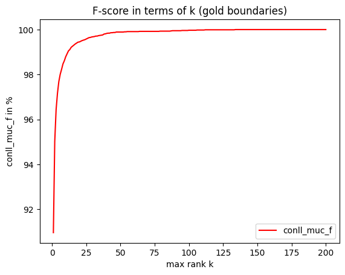
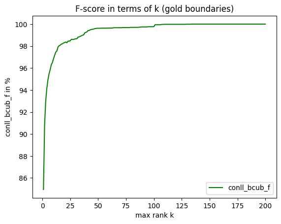
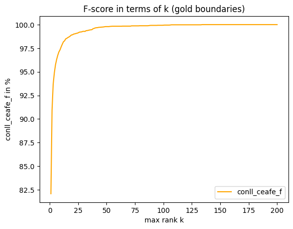
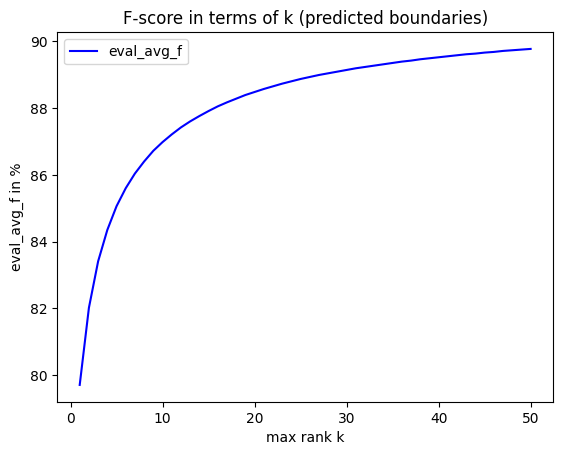
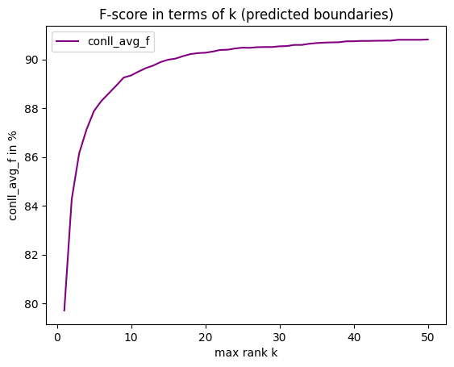
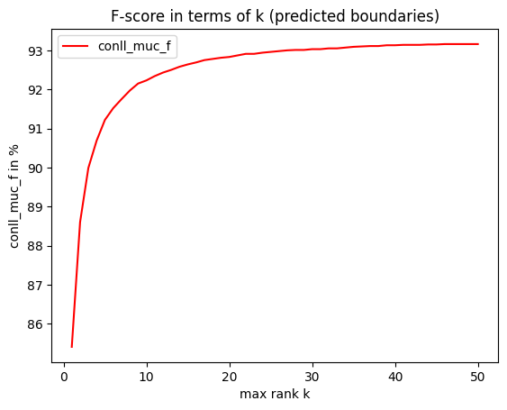
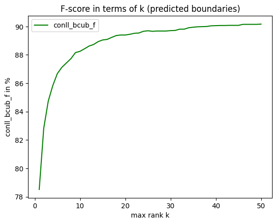
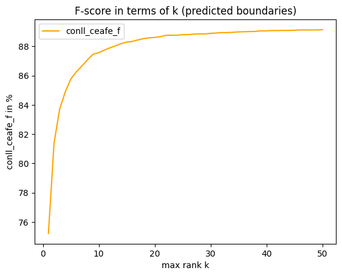

# Graduation project : improve neural coreference classifier via "k-best" approach

**Author** : Simon Decomble, Master 2 Machine Learning (2022/2023)

## Project introduction

In the field of coreference resolution, Deep Learning models have allowed performance gains recently. However, those approaches tend to be greedy and rely mainly on local coreference decisions. Some work has been made to consider more global information (relative to the coreference clusters), but those higher order methods were not enough conclusive.

In this project, we try to adapt some pre-neural global inference approaches to a recent coreference model (https://aclanthology.org/2020.emnlp-main.686/), and evaluate the impact on performance.

More precisely, the goal is to use the model code from https://github.com/lxucs/coref-hoi. This model reports the k best antecedents predictions for each detected mention, associated to a score to weight their likeliness to be the antecedent or to precise if it is dummy (score of 0, the mention is not anaphoric). But then, this model use only the 1-best predicted antecedents to create the coreference cluster. Here, we want to benefit from the k-best prediction and keep all the information to implement a less "greedy" approach (consider the k-best instead of the 1-best).  

First, the goal of this project is to evaluate the possible benefits from this k-best approach. Then, we will try to implement a prototype of less greedy approach similar to Luo et al's Bell Tree (https://aclanthology.org/P04-1018.pdf) to consider different types of clusterings at the same time during the construction of the tree, and perform a beam search in it (guided by prediction scores criteria).

## k-best approach gain evaluation

In this part, we try to evaluate the benefits of a score ranking approach. First, we log the gold (given by oracle) mention-antecedent pairs in CSV files (one file per test document). This step is named the *gold logging*.  
Then, we log the predicted mention-antecedent pairs, considering for each mention the k best antecedents according to the model, and the associated score. This is what we call the **k-best logging** (one CSV file per test document). This step can be done using the gold mentions boundaries (starts / ends) or the predicted boundaries.  
Finally, using the CSV files, we evaluate the gain of considering the k best antecedents for each mention and not just the first one. The precise process is described in the corresponding section below.  

### Commands to launch evaluations

#### 1. Gold logging

To log into `kba-antecedent-csv/{num_doc}-gold_antecedents.csv` the gold (from oracle) mention-antecedent pairs from the document of number *num_doc* (precise id is in the csv file). If the mention is not anaphoric, it is linked to the dummy antecedent (index -1). 

**Command** :  
`python kba-gold_logging.py CONFIG_NAME SAVED_SUFFIX [GPU_ID]`

(argument between brackets is optional, if not provided, no GPU used)

**Example used in this project** :  
`python kba-gold_logging.py train_spanbert_large_ml0_d1 May08_12-37-39_54000`

#### 2.a. k-best logging (gold boundaries)

To log into `kba-antecedent-csv/{num_doc}-k_best_ant_gold.csv` the **k** best predicted mention-antecedent pairs(according to antecedent score given by the model) from the document of number *num_doc* (precise id is in the csv file). If the mention is predicted as not anaphoric, it is linked to the dummy antecedent (index : -1, antecedent score : 0). For this logging, the gold spans boundaries (spans start and end given by the oracle) are used.

**Preliminary steps** :  
- in the *forward* method of model.py, let only `option = "gold_boundaries"` uncommented
- at the beginning of model.py : set MAX_TOP_ANTECEDENTS to wanted k value (200 in our evaluation)

**Command** :  
`python kba-kbest_logging.py CONFIG_NAME SAVED_SUFFIX  gold K_VALUE [GPU_ID]`

**Example used in this project** :  
`python kba-kbest_logging.py train_spanbert_large_ml0_d1 May08_12-37-39_54000 gold 200`

#### 2.b. k-best logging (predicted boundaries)

To log into `kba-antecedent-csv/{num_doc}-k_best_ant_gold.csv` the **k** best predicted mention-antecedent pairs(according to antecedent score given by the model) from the document of number *num_doc* (precise id is in the csv file). If the mention is predicted as not anaphoric, it is linked to the dummy antecedent (index : -1, antecedent score : 0). For this logging, the predicted spans boundaries are used. Those spans boundaries are computed at the very beginning of the end-to-end neural approach.

**Preliminary steps** :  
- in the *forward* method of model.py, let only `option = None` uncommented
- at the beginning of model.py : set MAX_TOP_ANTECEDENTS to wanted k value (50 in our evaluation) 

**Command** :  
`python kba-kbest_logging.py CONFIG_NAME SAVED_SUFFIX  predicted K_VALUE [GPU_ID]`

**Example used in this project** :  
`python kba-kbest_logging.py train_spanbert_large_ml0_d1 May08_12-37-39_54000 predicted 50`

#### 3.a. Evaluation from CSV files (gold boundaries)

Once the gold and kbest logging CSV files have been written, this process reads for each document the k-best predicted mention-antecedent pairs and compare them to the real (gold) pairs. If the gold is in the list, it is picked to build the cluster later ; else, the first prediction is used (like in the source repository's approach). We use this process by taking the value of k between 1 and K_MAX_VALUE (e.g. 200) and report the metrics in a csv file. For each mention, we consider k possible prediction, as k increase for each iteration of the process, we expect that the metrics also increase. For the gold boundaries case, as span detection cannot cascade errors on coreference, we expect that the results approach 100% precision/recall/f-score when k approaches 262 (the max number of antecedents observed in the test documents).

**Command** :  
`python kba-evaluate_from_csv.py CONFIG_NAME SAVED_SUFFIX gold K_MAX_VALUE [GPU_ID]`

**Example used in this project** :  
`python kba-evaluate_from_csv.py train_spanbert_large_ml0_d1 May08_12-37-39_54000 gold 200`

*Note* : Even if we evaluate from csv files, we need to provide the configuration and saved_suffix to instantiate the model, because the evaluator is necessarily linked to a model in the native implementation.

#### 3.b. Evaluation from CSV files (predicted boundaries)

See the explanation in the previous section.  
The expectations are similar, but we do not really expect that the f-score approaches 100% as the mention detection would not be perfect (span boundaries are not exact for each mention). Mention detection error would be cascaded over mention-antecedent pairs and then coreference results.

**Command** :  
`python kba-evaluate_from_csv.py CONFIG_NAME SAVED_SUFFIX predicted K_MAX_VALUE [GPU_ID]`

**Example used in this project** :  
`python kba-evaluate_from_csv.py train_spanbert_large_ml0_d1 May08_12-37-39_54000 predicted 50`

### Diff with source repository
List of modified files (compared to https://github.com/lxucs/coref-hoi, see precise diff between source and fork for more details) :
- conll.py : to extract mention detection metrics from the output of Pearl script
- evaluate.py : to add the possibility of CPU evaluation only
- model.py : to add gold boundaries option, reduce pruning and change max_top_antecedents (which is decided by a configuration field, but an existing configuration was used)
- run.py : to add new process methods (logging, evaluation from csv)

The new files and folders are prefixed by `kba-` (which stands for k-best antecedents approach).

### Extra remarks

A file `kba-checks.py` was used for debugging and some checks about mention-antecedents pairs. Specifically, to make stats about the predicted antecedents in the generated CSV files, compared to the gold, you can :
- generate the gold and kbest logging CSV files (see above)
- launch `python kba-checks.py gold` (gold boundaries) or `python kba-checks.py predicted` (predicted boundaries)

The output will show you how many mention-antecedents pairs are correctly predicted and reported in the prediction CSV file (whatever the rank k), and also if they are associated to positive, null, negative or minus infinity score.  
For the CSV files generated in this project (k = 200 for gold boundaries and k = 50 for predicted boundaries), the two outputs are below :
```
Stats about correct antecedents predictions (gold boundaries), recorded in csv files given the max rank k

  Nb positive scores :     62.78% (12407/19764)
  Nb null scores (dummy) : 22.93% (4532/19764)
  Nb negative scores :     14.29% (2825/19764)
--------------------------
  TOTAL (predicted) :      100.00% (19764/19764)
--------------------------
  Nb unpredicted :         0.00% (0/19764) -> number of missing correct antecedent prediction
  Nb -infinity scores :    0.00% (0/19764)
```
  
```
Stats about correct antecedents predictions (predicted boundaries), recorded in csv files given the max rank k

  Nb positive scores :     62.02% (12258/19764)
  Nb null scores (dummy) : 21.64% (4277/19764)
  Nb negative scores :     10.30% (2035/19764)
--------------------------
  TOTAL (predicted) :      93.96% (18570/19764)
--------------------------
  Nb unpredicted :         6.04% (1194/19764) -> number of missing correct antecedent prediction
  Nb -infinity scores :    0.00% (0/19764)
```

We tried to modify the source code at minimum and allow reproducibility of experiments through command line, but a few steps are sometimes necessary before, directly in the code. This is because :  
- we used an existing configuration
- we implement the use of gold boundaries in the model forward step, which was not a native feature.

The max number of antecedents for the test documents is 262, so the maximum k value for test documents is probably this one. Due to memory limits, the experiment was made with k = 50 for predicted boundaries and k = 200 for gold boundaries.
The forward step of the model is indeed more memory-consuming with predicted boundaries.  

The machine on which the experiments were made has 8 GB of RAM, the processes were made without any memory-consuming application concurrency. The memory consumption for the prediction process (for some documents) was higher than 7 GB if the value of k goes beyond 50 (predicted boundaries) / 200 (gold boundaries).

### Results

The reported metrics are native and computed thanks to a source repo Python's module and a Pearl script. We used those engines to evaluate the impact of our approach and report the metrics in `kba-metrics/k-metrics-gold_boundaries.csv` and `kba-metrics/k-metrics-pred_boundaries.csv`.  

We made the corresponding graphs for the 5 different f-scores :
- Python evaluation averaged
- CoNLL MUC metric
- CoNLL B-CUBED metric
- CoNLL CEAFe metric
- the average of the three previous : CoNLL averaged

#### 1. Gold boundaries







When we use gold span boundaries, all f-scores approach 100% when k increases. The value k = 50 (which is the default max_top_antecedents value in configuration) seems to show almost perfect results for CoNLL in terms of potential gain : i.e. we can expect to have a clustering really near to the perfect one if we consider 50 antecedents for each mention and pick the best each time.  
For the "eval_avg_f" (Python averaged evaluation), the convergence seems to be slower, and we don't reach the 100% for k = 200, unlike the 4 other f-scores. The reasons behind that are not figured out.

#### 2. Predicted boundaries







When we use predicted span boundaries, the f-scores are also logically increasing with k. However, we only reach scores near 90%. There are two reasons to explain that.  
On the one hand, the evaluation was restricted to k = 50 (because of memory limitation), we can expect to go beyond for higher values of k.  
On the other hand, statistics about correct predicted boundaries in the whole CSV files (see *Extra remarks* above) have shown that there are only about 93% of antecedents that are correctly reported in CSV files. We can assume that the extra 7% are missing because the model did not compute the correct span boundaries (as there are 0% missing when we use gold boundaries).  
So, the main part of explanation of this performance limitation near 90% when k increase is probably caused by a cascading error from some uncorrect spans start/end.  

## A Bell Tree approach from the k-best antecedent ranking

We have seen in the previous part that considering other mention-antecedents pairs can be profitable to create better partitions. Thus, we adopt a more global approach to consider other possible antecedents in the process. Moreover, we proceed at the entity scale. We adapt the Bell Tree approach of Luo et al. (https://aclanthology.org/P04-1018.pdf), using the predictor mention-antecedent scores. Those scores are already logged into the `kba-antecedents-csv` CSV files (namely the `{i}-k_best_ant_gold_bound.csv` files).

### The Bell Tree principle
We go from right to left in the document, and for each mention, we evaluate its compatibility with already built clusters (representing entities). This compatibility considers each score between the current mention and the antecedents from the partial cluster. Those scores are then aggregated in a specific way inside the cluster (maximum : `max`, average : `avg`) to create a score between the current mention and each cluster. We create the next generation of the Bell Tree by creating successor partitions this way : the first successor is the predecessor partition plus a new cluster with only the new mention. The others are obtained by adding the new mention to each partial cluster at once, covering all possibilities. To have more details about the process, see Luo et al.'s paper, Figure 1 specifically. Each partitition has a score in the Bell Tree. The first partition, with the first mention, has score 0. Then, at each generation, we compute the aggregated score between a new mention and existing clusters, and this score is added to the predecessor's to get the successor partition's cumulative score. The tree is then pruned by beam search, keeping only the B best-scored partitions among every successors of this generation. Then, we repeat the process until the last mention, and select the best-scored one.  

In our implementation, we use the gold boundaries to focus on the main task of anaphor-antecedent linking and partition build.

### Launch experiments

Be sure that the `{i}-k_best_ant_gold_bound.csv` files are correctly generated. Otherwise, follow the steps of the section `2.a. k-best logging (gold boundaries)` above.  

**Command** :  
`python kba-bell_tree.py CONFIG_NAME SAVED_PREFIX INTRA_AGGREGATIONS_LIST NBS_BEAMS_LIST [GPU_ID]`  

- the argument GPU_ID is between brackets because it is optional
- INTRA_AGGREGATIONS_LIST contains between brackets the chosen intra-cluster aggregations strategies
- NBS_BEAMS_LIST contains between brackets the chosen numbers of beams in the beam search
- every combinations of intra aggregations and number beams are performed

**Example used in this project** :   
`python kba-bell_tree.py train_spanbert_large_ml0_d1 May08_12-37-39_54000 "[max,avg]" "[1,5,10]"`  

In this example, the Bell Tree beam search is performed with the parameters (max, 1), (max, 5), (max, 10), (avg, 1), (avg, 5), (avg_10).  

### Results

Results of our experiment are reported in `kba-metrics/bt-metrics-gold_boundaries.csv`.  
We report the main metrics (f-scores), the same as in the k-best evaluation above, plus the CoNLL mention detection f-score (conll_md_f).  

| intra_aggregation | nb_beams | eval_avg_f | conll_avg_f | conll_md_f | conll_muc_f | conll_bcub_f | conll_ceafe_f |
|-------------------|----------|------------|-------------|------------|-------------|--------------|---------------|
| max               | 1        | 86.01      | 85.9967     | 93.21      | 90.96       | 84.95        | 82.08         |
| max               | 5        | 86.01      | 85.9967     | 93.21      | 90.96       | 84.95        | 82.08         |
| max               | 10       | 86.01      | 85.9967     | 93.21      | 90.96       | 84.95        | 82.08         |
| avg               | 1        | 84.42      | 84.4100     | 92.85      | 89.89       | 82.52        | 80.82         |
| avg               | 5        | 82.03      | 82.0200     | 92.56      | 88.75       | 78.86        | 78.45         |
| avg               | 10       | 81.31      | 81.2933     | 92.47      | 88.44       | 77.73        | 77.71         |

#### Max intra-cluster aggregation

For the strategy of taking the maximum score between the new span and each antecedent of a cluster, and a 1-beam search, we notice the same results than the control case (with gold span boundaries). This result was expected because using the maximum function to aggregate scores and only one beam through the Bell tree lead to an equivalent to the process made by the base model.  

When we increase the number of beams, the results remain the same. Thus, with the max score aggregator, we don't discover paths through the Bell Tree that have a better accumulated score. We can assume that this is because best mention-antecedent score is often really much higher than the others. So, keeping the best one for each iteration and accumulate it lead to the same results, even with more beams in the search. 

#### Average intra-cluster aggregation

In a 1-beam search, using the mean aggregation within each cluster leads to a performance drop of 1.5 % in f-score compared to the max aggregation. That result means that the more global information (score with the previous mentions of the same entity) have a negative impact on the coreference task.  
When we increase the number of beams in the search, the performance keeps decreasing. With 10 beams, we have more than 4.5 % of performance drop compared to the max aggregation.  

A possible explanation to that observation could be that the scoring function was learned to assess positively the pairs containing a mention and its direct antecedent. Thus, the score with the previous antecedents is not necessarily high, and maybe will decrease even more with the distance.  

At this stage, our approach does not improve the task but it could be relevant to investigate other aggregation steps or strategies, more adapted to the scoring function, e.g. by emphasing an antecedent score relatively to its recentness.